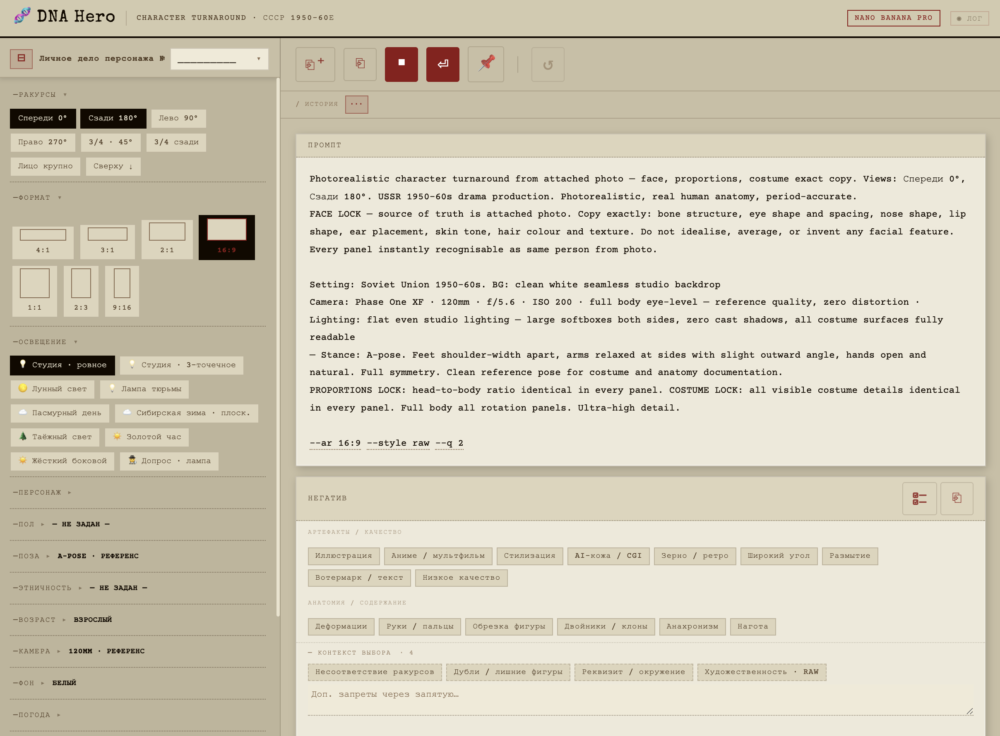

# DNA Hero 🧬 [Beta]

> 🧩 **Гибкий конструктор промптов** — собирай фотореалистичный character turnaround по модулям, как LEGO. Каждый ползунок, чип и чекбокс → конкретный текст в промпте. Без гадания.

**[▶ Открыть в браузере — попробовать сейчас](https://lexbayart.github.io/dna-hero/)**
🚫 Без установки · 🚫 Без аккаунта · ✅ Работает офлайн

---

## 🎯 Что это и зачем

DNA Hero — это **рабочий процесс**, а не просто форма с полями. Вы собираете промпт интерактивно: кликаете чипы, двигаете слайдеры, переключаете режимы — и справа в реальном времени видите готовый промпт, который можно сразу копировать в AI-генератор.

🔒 **Главная проблема, которую решает:** когда вы просите AI нарисовать персонажа с нескольких ракурсов — лицо «плывёт», детали костюма расходятся, пропорции скачут. DNA Hero выстраивает промпт с явными блоками FACE LOCK, PROPORTIONS LOCK, COSTUME LOCK — модель понимает, что именно должно оставаться неизменным на каждом ракурсе.

🎨 Интерфейс стилизован под «личное дело» из советского архива — но это просто скин. Под капотом — мощная система тонкой настройки каждого аспекта персонажа.

---

## 🧩 Конструктор — что можно настраивать

### 📐 Ракурсы · 7 на выбор
Спереди 0° · Сзади 180° · Лево 90° · Право 270° · 3/4 · 3/4 сзади · Лицо крупно 🤳 · Сверху ↓
**Мульти-выбор** — комбинируйте сколько угодно, промпт сам расставит панели в правильном порядке ✨

### 💡 Освещение · 7 пресетов
Студия ровное · 3-точечное · Лунный свет 🌕 · Лампа тюрьмы 💡 · Пасмурный день ☁️ · Сибирская зима · Таёжный свет 🌲 · Золотой час ☀️ · Жёсткий боковой · Допрос
Каждый пресет → развёрнутое физически-корректное описание с тенями, температурой, направлением

### 📷 Камера · 4 объектива
120mm референс (без искажений) · 85mm портрет (shallow DOF) · 35mm кино (широкий план) · 200mm теле (макс. резкость)

### 🖼️ Формат кадра · 6 вариантов
4:1 turnaround-лист · 3:1 · 2:1 · 16:9 кинематограф · 1:1 квадрат · 2:3 портрет · 9:16 мобильная история 📱

### 👤 Персонаж
- ✏️ **Свободное описание** — пишите что угодно, текст попадёт в промпт
- ♂️/♀️ **Пол** — явное указание для модели
- 🌍 **Этнический контекст** — 7 вариантов (мягкий культурный фрейм, не переопределяет фото)
- 📏 **Возраст** — 5 категорий: взрослый / пожилой 60–70 / старик 75–85 / подросток 14–16 / ребёнок 7–8 / дошкольник 3–4
- 🧍 **Поза** — A-Pose (референс) / T-Pose (риггинг)

### 🎭 Настроение · 14 эмоций
Нейтральный 😐 · Грустный 😢 · Гневный 😠 · Испуганный 😨 · Отчаянный 😭 · Решительный 😤 · Подавленный 😔 · Растерянный 😶 · Умоляющий 🥺 · Шок 😲 · Замёрзший 🥶 · Изнурённый 😮‍💨 · Радостный 😊 · Гордый 🫡 · Нежный 🥰 · Надежда 🌟 · Лукавый 😏 · Стоический 🗿
Каждая эмоция → детальное описание мимики + позы тела

### 🩸 SFX-повреждения · 10 эффектов
Порез · Синяк · Кровь из носа · Разбитая губа · Гематома · Шрам · Перевязка · Ожог · Ссадина · Перелом носа · Обморожение ❄️ · Потрескавшиеся губы 🥶
Каждое → «film-grade SFX makeup» описание для генератора

### 🌦️ Погода · 4 слайдера (0–10)
💧 Мокрость (от влаги на коже до «только что из воды»)
❄️ Снег (от инея на волосах до ледяной скорлупы)
💨 Ветер (от бриза до «едва стоишь на ногах»)
🌫 Пыль/грязь (от пыли на ботинках до «сделан из земли»)

### 🧥 Износ · 2 слайдера (0–10)
🧥 Поношенность (от складок до «больше лоскутов, чем одежды»)
🔴 Повреждения (от потёртостей до катастрофического разрушения)

### 🎨 Стиль генерации
RAW без стилизации · RAW + stylize 0 (сухой) · Stylize 200 (мягкая свобода) · Stylize 750 ⚠ (сильная стилизация)

### 🚫 Негативный промпт · Умный
- 📦 **Статические чипы** — артефакты, анатомия, анахронизмы, нагота
- ⚡ **Контекстные чипы** — автоматически появляются при определённых настройках! (выбрали лунный свет? → появился «тёплый свет». Выбрали 2+ ракурса? → «несоответствие между панелями»)
- 📝 **Кастомное поле** — пишите свои запреты
- ☑️ **Выбрать/снять все** одной кнопкой

---

## 🛠️ Рабочий процесс

### 💾 Система «Личное дело»
Сохраняйте настройки как именованные пресеты. Авто-сохранение при каждом изменении. Переименование, дублирование, удаление. Звёздочка * показывает несохранённые изменения ⭐

### 📜 История · 8 снапшотов
Каждое изменение фиксируется. Кликайте по снапшоту — возвращаетесь к этому состоянию. Умные снапшоты: редактируете одну секцию → перезаписывается тот же слот, новая секция → новый слот.

### 📋 Копирование
⎘⁺ Всё (промпт + негатив) · ⎘ Только промпт · 📋 Только негатив

### 🔄 Режимы промпта
📄 **Подробный** — структурированный по блокам: [PRIMARY DIRECTIVE], [FACE LOCK], [CHARACTER], [TASK], [CONDITIONS], [CONSISTENCY], [TECHNICAL]
📝 **Краткий** — компактный, для быстрых итераций

---

## 🚀 Запуск

**[▶ lexbayart.github.io/dna-hero](https://lexbayart.github.io/dna-hero/)**

Или скачайте `index.html` и откройте в браузере — один файл, полная автономность 🏝️

---

## 📖 Документация

📘 [**Полное руководство пользователя**](docs/GUIDE.md) — все инструменты, горячие клавиши, пошаговые объяснения

---

## 🛠️ Технологии

⚡ Vanilla JS · 🖼️ HTML5 · 🎨 CSS3 (custom properties, grid, flexbox)
🔤 Google Fonts (Special Elite, Courier Prime)
📦 Single HTML file · 🚫 Zero dependencies · 🚫 Zero build step

---

## 💬 Обратная связь

Проект в активной разработке 🚀 Нашли баг? Есть идея?

- ✈️ **Telegram:** [@lexbay](https://t.me/lexbay)
- 🐛 **GitHub Issues:** [Открыть issue](https://github.com/lexbayart/dna-hero/issues)

---

## 📄 Лицензия

© 2025 lexbayart — [CC BY-NC 4.0](https://creativecommons.org/licenses/by-nc/4.0/)

Свободно для некоммерческого использования с указанием авторства. Коммерческое использование — по согласованию с автором 🤝
